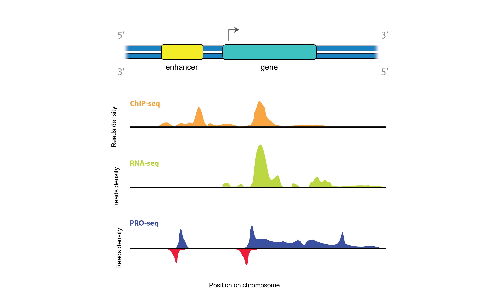
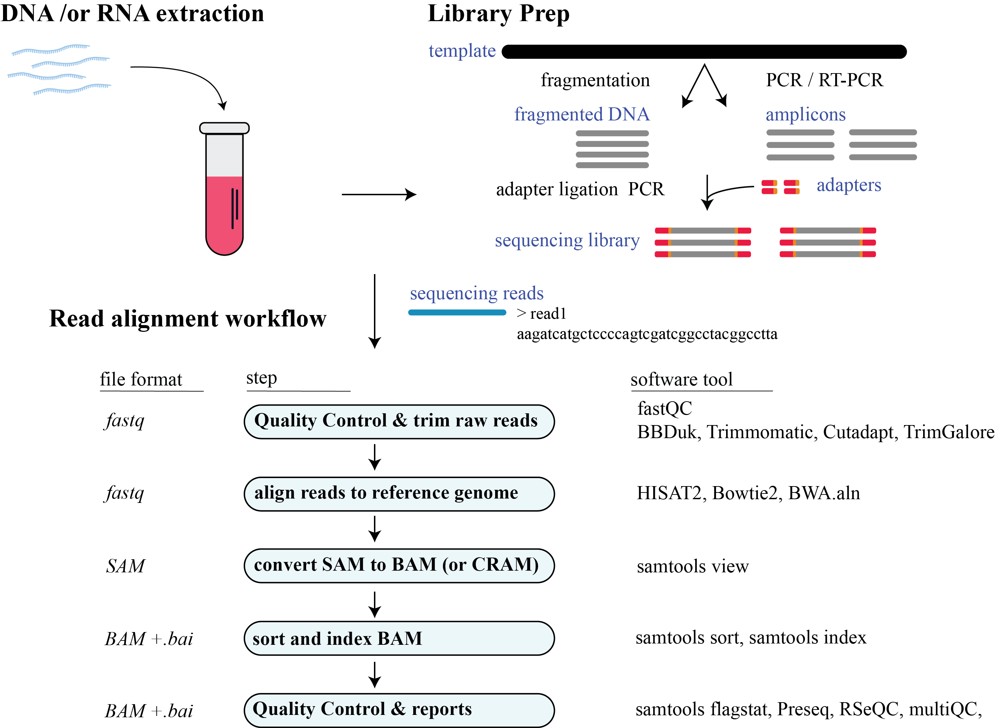

# Next-generation sequence (NGS)
NGS enable scientists to use high-throughput sequencing of DNA and RNA. In this repository I go over some of the basic tools that I have used to analyze my sequencing data. 

## Pipelines
To work with NGS data, the process involves extracting raw FASTQ data from a sequencer and passing it through a NGS pipeline. This pipeline includes quality control, pre-processing, and alignment to a reference genome. This systematic approach transforms the initial raw sequencing data into interpretable information, enabling the extraction of valuable biological insights.

The 'pipeline' directory contains the pipeline shell script for 3 different NGS sequencing datatype; ChIP-seq, RNA-seq, and PRO-seq (nascent transcription).

### Additional resources
* [NBCI SRA](https://www.ncbi.nlm.nih.gov/sra): Database to access and download public NGS data.
* [Illumina's Introduction to NGS](https://www.illumina.com/science/technology/next-generation-sequencing.html): Illumina provides information on NGS sequencing technologies.
* [DnA Short Reads Workshop](https://biodatasci.colorado.edu/shortread/): Previous online tutorial from the in-person workshop.

